<h3>About Me</h3>

<table align="center" cellspacing="0" cellpadding="0">
<tr>
<td valign="top"></td>
<td valign="top"></td>
</tr>
</table>

  

<h3>Contributions</h3>

  

<h3>Links</h3>

<b>Math / CS Student · University of Waterloo</b>

 

